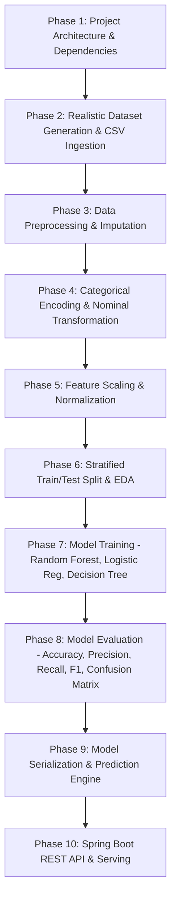

<<<<<<< HEAD
# Banking-Loan-Default-Prediction-in-java
=======
# 🏦 Bank Loan Default Prediction System (Pure Java Machine Learning)


An end-to-end, production-quality **Machine Learning System** built **100% in Java** to predict whether a customer will default on a bank loan based on financial, demographic, and credit risk indicators.

---

## 📌 Project Overview
Banks and financial institutions face significant credit risk when granting loans. Identifying high-risk applicants before loan approval minimizes non-performing assets (NPAs) and preserves capital.

This project implements a complete **Java ML Pipeline**—from synthetic dataset generation (10,000+ records) and preprocessing to model training (Random Forest, Logistic Regression, Decision Tree), evaluation, serialization, and serving via a Spring Boot REST API.

---

## 🏗 System Architecture & 10 Execution Phases



---

## 📦 Tech Stack
- **Language**: Java 17+ (No Python used)
- **Machine Learning Engine**: Weka 3.8.6 (Pure Java)
- **CSV Engine**: Apache Commons CSV 1.10.0
- **REST Framework**: Spring Boot 3.2.3
- **Build Tool**: Maven

---

## 📂 Project Structure
```
Banking-Loan-Default-Prediction-in-java/
├── data/
│   ├── loan_default_dataset.csv       # 10,000+ records dataset
│   └── trained_loan_model.model       # Serialized trained Weka model
├── src/main/java/com/bank/loan/
│   ├── BankLoanApplication.java       # Spring Boot Main Application
│   ├── data/                          # Dataset generator & CSV loader
│   ├── preprocessing/                 # Preprocessing, Imputation, Scaling
│   ├── model/                         # ML Model Trainer & Serializer
│   ├── evaluation/                    # Metrics, Confusion Matrix, Model Comparer
│   ├── prediction/                    # Loan Prediction Engine & Risk Evaluator
│   └── api/                           # Spring Boot REST Controller & DTOs
├── pom.xml                            # Dependencies & Build Configuration
└── README.md                          # Comprehensive Documentation
```
>>>>>>> 9f75f18 (Phase 1: Initialize Project Architecture, pom.xml dependencies, and README)
